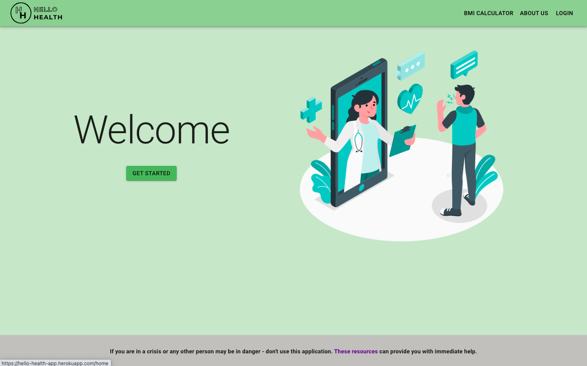
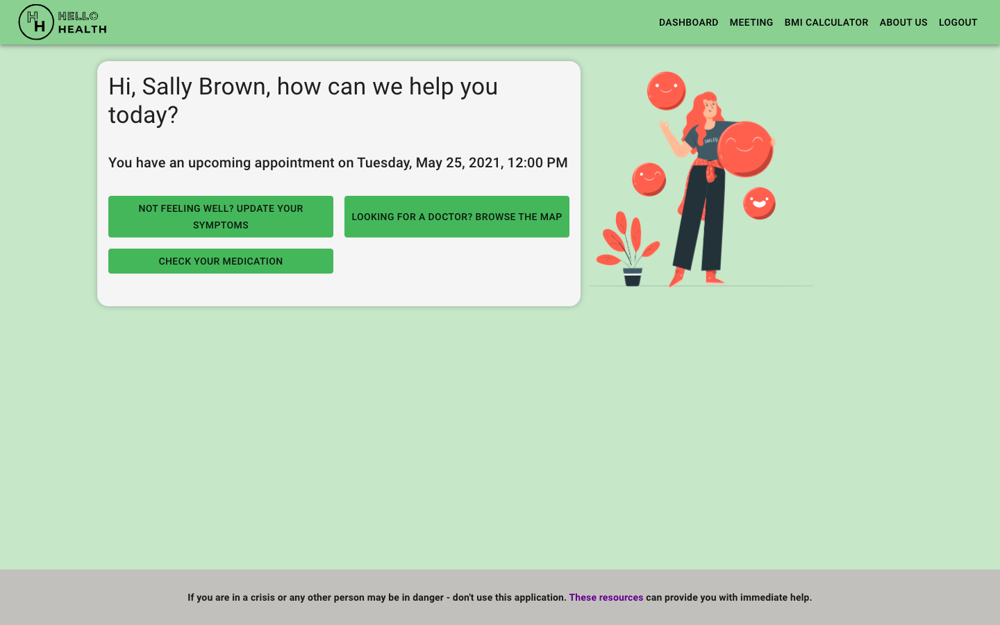
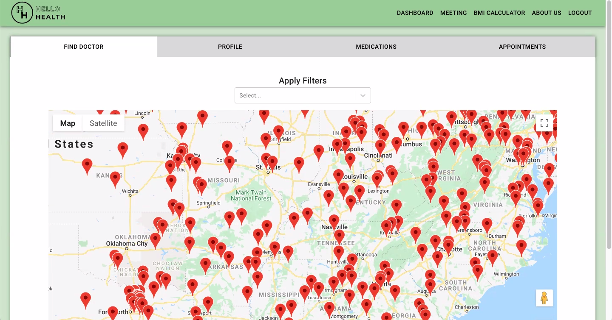
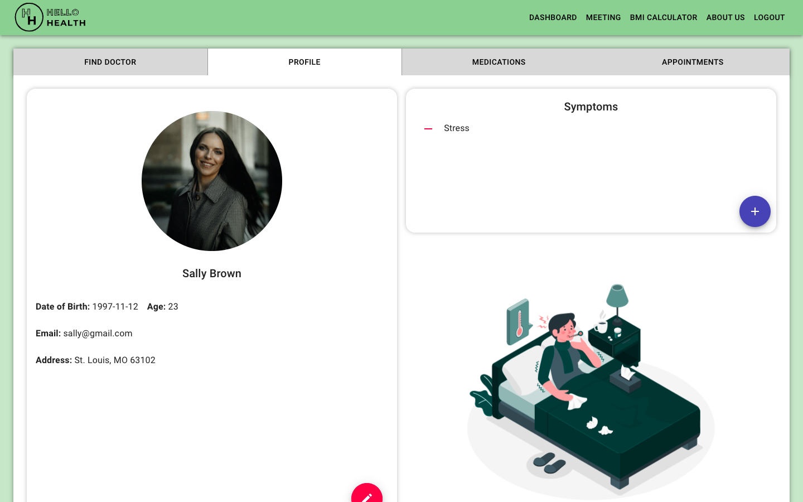
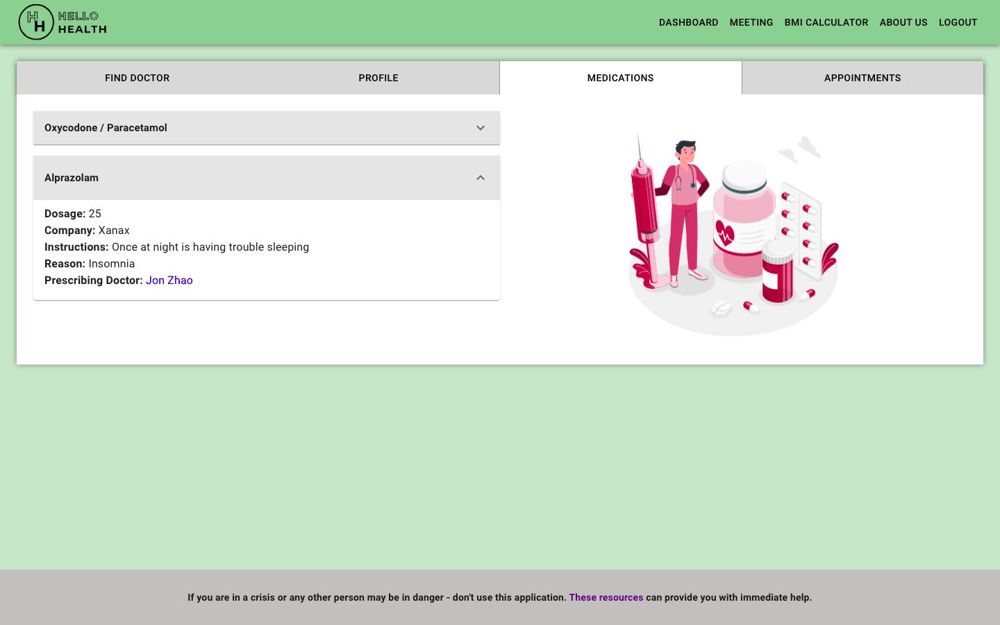
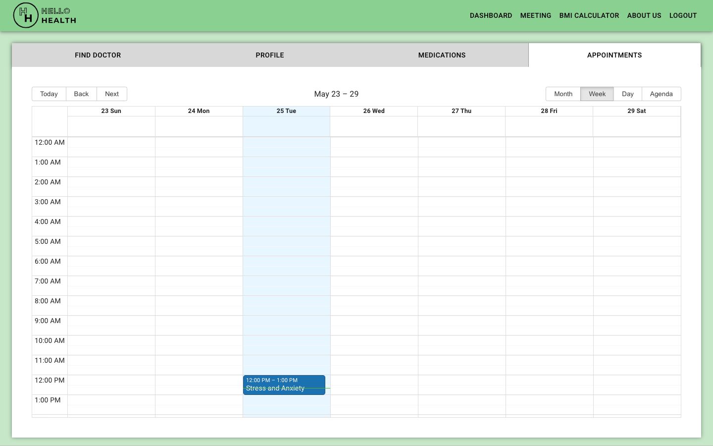
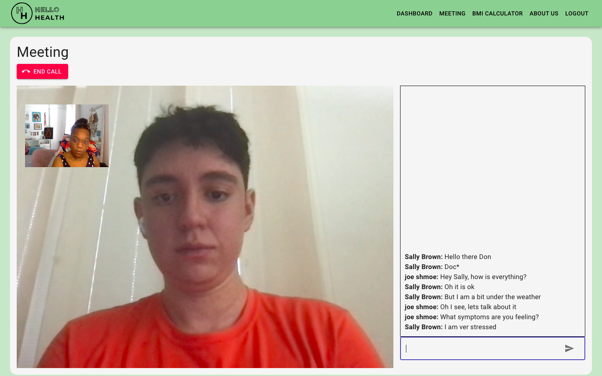

# HelloHealth

https://hello-health-app.herokuapp.com/

## Description

Our application is a one-stop-shop for finding and connecting with a mental health practitioner. After signing up with our application, a user you can view a list of partner practitioners in and area their area. They can select a practitioner and schedule an appointment with them. Our application also offers the ability to host a consultation video meeting with your scheduled practitioner right from the application. There is also the option to message a practitioner using the application chat feature.

## View Snapshots

      

## Roadmap

The initial focus for our application was providing mental health access and services. Pending the usage and success of the application, we would consider expanding to a wider array of health services. This would include but is not limited to:

- group counseling virtual sessions
- general and annual check ups
- last minute urgent care
- symptoms diagnosis
- medical record keeping
- health and fitness tracking

## Authors

Developers behind building HelloHealth:

- [Chiara Wahsono](https://github.com/chiarawahsono)
- [Christopher Gil-Martins](https://github.com/chris-gil-martins)
- [Mohammad Mussab](https://github.com/Mmussab)
- [Sarahjean Marhône](https://github.com/sjmarhone)

## Support

For more support on the application you can reach out to the developers via GitHub.
